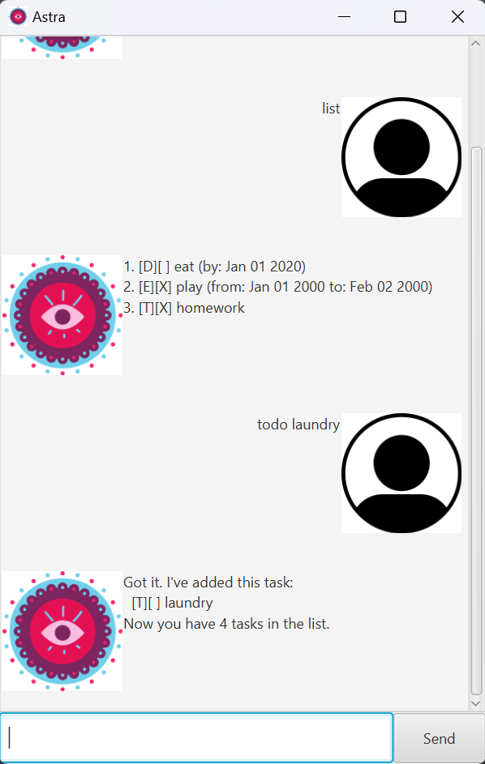

# Astra User Guide




## Introduction
Astra is a **desktop app for managing tasks**.
It is designed to take **short and powerful commands** to help you manage your tasks efficiently 
while also providing a **simple and clean interface** for you to interact with.

## Features

### Adding a todo: `todo`
Adds a todo task to the task list. 

Format: `todo DESCRIPTION` \
Example: `todo read book`

### Adding a deadline: `deadline`

Adds a deadline task to the task list. \
Date should be in the format `YYYY-MM-DD`.

Format: `deadline DESCRIPTION /by DATE` \
Example: `deadline return book /by 2024-09-30`

### Adding an event: `event`

Adds an event task to the task list. \
Dates should be in the format `YYYY-MM-DD`.

Format: `event DESCRIPTION /from START_DATE /to END_DATE` \
Example: `event project meeting /from 2024-09-30 /to 2024-10-01`

### Listing all tasks: `list`

Shows a list of all tasks in the task list.

Format: `list`

### Deleting a task: `delete`

Deletes a task from the task list.

Format: `delete INDEX` \
Example: `delete 3`

### Mark as done: `mark`

Marks a task as done.

Format: `mark INDEX` \
Example: `mark 2` \
Sample output: 
```
Nice! I've marked this task as done:
[T][X] read book
```

### Mark as undone: `unmark`

Marks a task as undone.

Format: `unmark INDEX` \
Example: `unmark 2` \
Sample output:
```
Ok, I've marked this task as not done yet:
[T][ ] read book
```

### Finding tasks: `find`

Finds tasks that contain the given keyword.

Format: `find KEYWORD` \
Example: `find book`

### Sorting tasks: `sort`

Sorts tasks by their deadline and displays task list. \
Tasks without a deadline will be placed at the end. \
Events will be sorted by their start date.

Format: `sort` \
Sample output:
```
Here are the tasks in your list sorted by deadline:
1. [D][ ] return book (by: Sep 20 2024)
2. [E][ ] project meeting (from: Sep 30 2024 to: Oct 01 2024)
3. [T][ ] read book
```